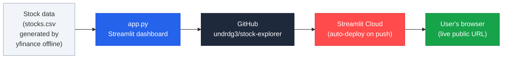
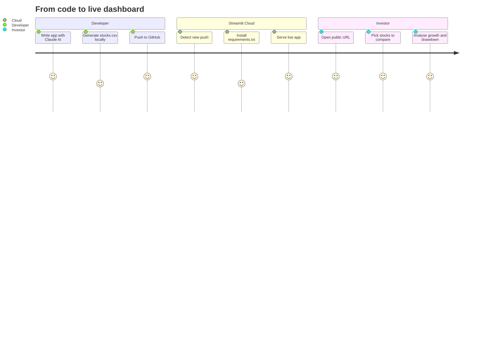

# Equity Performance Dashboard

A professional stock-performance web app comparing AAPL, MSFT, GOOG, AMZN, META, and NFLX from January 2018 to present. Built with Streamlit and driven end-to-end through Claude AI and MCP skill packs.

## Live app

> [https://stock-explorer-matej.streamlit.app](https://stock-explorer-matej.streamlit.app)

## Features

- Pill-style stock picker — select any combination of the six tickers
- Normalized price chart with a date-range zoom slider
- Total-growth bar chart (green = gain, red = loss)
- Best-performer highlight and per-stock growth cards
- Max drawdown, CAGR, and volatility comparison table
- "What if I invested $X?" calculator
- Did you know? investor fact (Apple Q3 FY2024 — $85.8B revenue, all-time Services record)

## Architecture



## How it works

1. **Data** — `fetch_data.py` downloads split-adjusted daily closing prices from Yahoo Finance via `yfinance`, normalizes each ticker to 1.00 on the first trading day, and writes `stocks.csv`. The app reads this CSV at runtime — no live API calls.
2. **App** — `app.py` is a pure Streamlit app. All analytics (CAGR, max drawdown, volatility) are computed from `stocks.csv` using pandas and numpy.
3. **Deploy** — pushing to GitHub triggers an automatic redeploy on Streamlit Community Cloud.

## User journey



## Running locally

```bash
pip install -r requirements.txt
streamlit run app.py
```

To refresh the stock data:

```bash
pip install yfinance
python fetch_data.py
```

## Tech stack

| Layer | Tool |
|---|---|
| App framework | Streamlit 1.41 |
| Data | yfinance (offline) → stocks.csv |
| Charts | Plotly Express |
| Data wrangling | pandas, numpy |
| Hosting | Streamlit Community Cloud |
| AI assistant | Claude (Anthropic) via MCP skill packs |

## MCP skill packs used

| Skill pack | Used for |
|---|---|
| Context7 | Current Streamlit syntax for `st.pills`, `st.slider`, `st.dataframe` Styler |
| Fetch / WebFetch | Pulled Apple Q3 FY2024 investor-relations fact |
| GitHub MCP | Created repo, pushed code |
| Playwright | Live-app screenshot for submission |
| Mermaid | Architecture and user-journey diagrams in this README |
